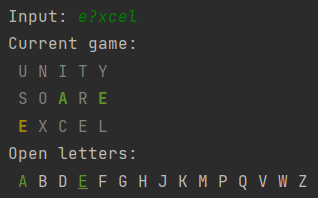

# Wordle helper
Personal helper for [Wordle](https://www.nytimes.com/games/wordle/index.html).  
You can play previous rounds at https://wordlearchive.com/.

## Getting started
In the root of the project, create a file `all_words.txt` that contains all playable words (not included in this 
repository to avoid any trouble). You can search for such a list online. Every word must be on a separate line.
If not possible, you can rename `words.txt` to `all_words.txt`. `words.txt` is a collection of five-letter words I've
written down as they came to my mind.

## Entry points
### TurnEvaluator
Run `TurnEvaluator` for suggestions on words to play in Wordle. Play the first word and input the results.
A question mark after a letter indicates the letter evaluated to yellow;
an exclamation mark indicates it was green. A lone letter signifies it evaluated to gray.

For example, input `PR?OU!D` for:  

After every turn, the available letters are shown and words are scored by different metrics to determine the
best word to play next.
The letter board gives an overview of available letters: any letters that have mismatched in the past are skipped;
available letters are shown in green or yellow to reflect what information is available about them.
Letters are underlined if we know exactly how many times the letter must appear:

Type `help` for more instructions.

### StartWordEvaluator

This class tries to find good starting words based on different metrics. It is a somewhat failed experiment—it is easier
to look up articles on good starting words and remembering them (I personally often use `SOARE` or `ARISE`).